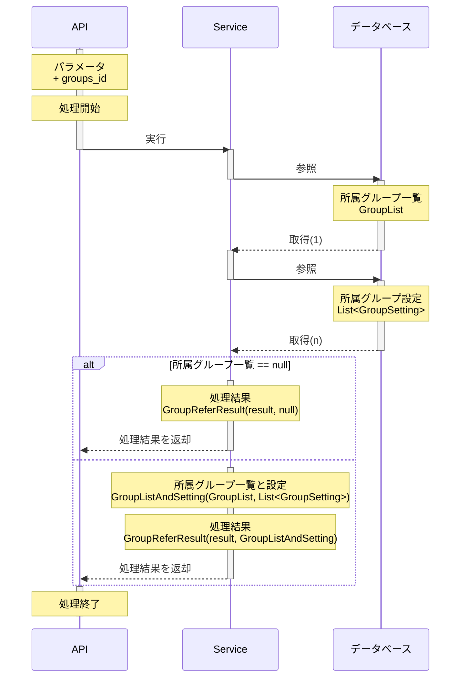

# 所属グループ参照API

## 目的

所属グループに関連する情報を参照する

## 処理概要

所属グループIDに紐づく所属グループの一覧と設定の情報を取得する

## HTTPメソッド

| HTTPメソッド |
|:---------|
| GET      |

## APIパス

| パス              |
|:----------------|
| api/group/refer |

## リクエストパラメータ

| パラメータ名    | 必須 | 属性     | 桁数 | 説明       |
|:----------|:---|:-------|:---|:---------|
| groups_id | ○  | String | 64 | 所属グループID |

## レスポンスパラメータ

### 成功時

| パラメータ名  | 属性     | 説明                  |
|:--------|:-------|:--------------------|
| status  | String | レスポンスステータス(success) |
| message | String | レスポンスメッセージ          |
| data    | Object | 後述の「dataオブジェクト」を参照  |

#### dataオブジェクト

| パラメータ名        | 属性          | 説明                          |
|:--------------|:------------|:----------------------------|
| group_list    | Object      | 後述の「group_listオブジェクト」を参照    |
| group_setting | List:Object | 後述の「group_settingオブジェクト」を参照 |

#### group_listオブジェクト

| パラメータ名         | 属性     | 説明            |
|:---------------|:-------|:--------------|
| id             | Int    | 所属グループ一覧の識別ID |
| groups_id      | String | 所属グループID      |
| group_name     | String | 所属グループ名       |
| group_password | String | 所属グループパスワード   |

#### group_settingオブジェクト

| パラメータ名        | 属性     | 説明            |
|:--------------|:-------|:--------------|
| id            | Int    | 所属グループ設定の識別ID |
| setting_key   | String | 所属グループ設定キー    |
| setting_value | String | 所属グループ設定値     |

### 失敗時

[共通レスポンスパラメータ_エラー](../共通レスポンスパラメータ_エラー.md)
に従う

## その他

なし

## シーケンス図

※インターフェースやデータソース層の処理は省略して記載

