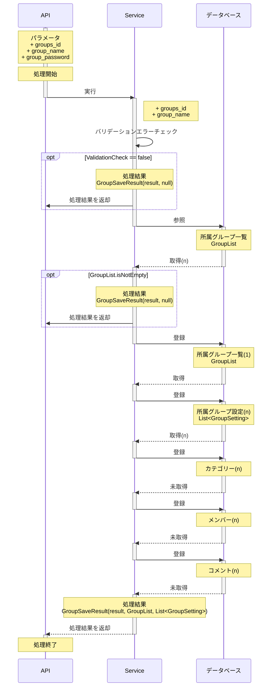

# 所属グループ登録API

## 目的

所属グループに関連する情報を登録する

## 処理概要

所属グループの一覧と設定の情報を登録する

## HTTPメソッド

| HTTPメソッド |
|:---------|
| POST     |

## APIパス

| パス               |
|:-----------------|
| api/group/create |

## リクエストパラメータ

| パラメータ名         | 必須 | 属性     | 桁数 | 説明          |
|:---------------|:---|:-------|:---|:------------|
| groups_id      | ○  | String | 64 | 所属グループID    |
| group_name     | ○  | String | 64 | 所属グループ名     |
| group_password | ○  | String | 64 | 所属グループパスワード |

## レスポンスパラメータ

### 成功時

| パラメータ名  | 属性     | 説明                  |
|:--------|:-------|:--------------------|
| status  | String | レスポンスステータス(success) |
| message | String | レスポンスメッセージ          |
| data    | Object | 後述の「dataオブジェクト」を参照  |

#### dataオブジェクト

| パラメータ名         | 属性     | 説明            |
|:---------------|:-------|:--------------|
| id             | Int    | 所属グループ一覧の識別ID |
| groups_id      | String | 所属グループID      |
| group_name     | String | 所属グループ名       |
| group_password | String | 所属グループパスワード   |

### 失敗時

[共通レスポンスパラメータ_エラー](../共通レスポンスパラメータ_エラー.md)
に従う

## その他

なし

## シーケンス図

※インターフェースやデータソース層の処理は省略して記載

