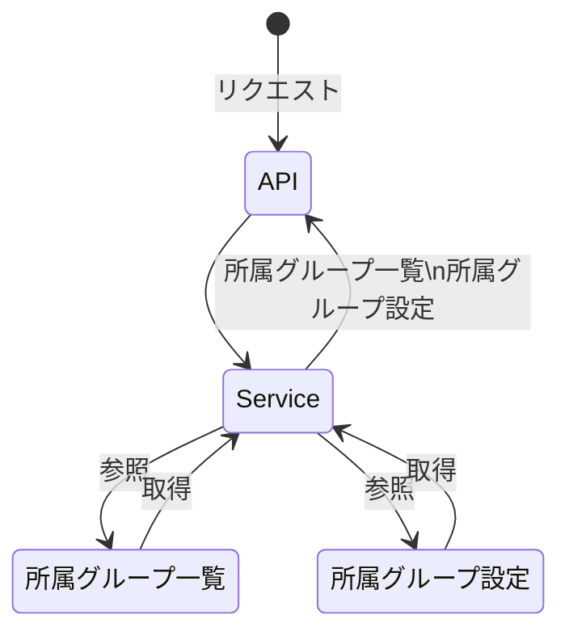

# [API名]

## 目的

## 処理概要

## APIパス

| パス          |
|:------------|
| api/XXX/XXX |

## リクエストパラメータ

| パラメータ名 | 必須   | 属性   | 桁数   | 説明   |
|:-------|:-----|:-----|:-----|:-----|
| XXXX   | XXXX | XXXX | XXXX | XXXX |

## レスポンスパラメータ

| パラメータ名 |      | 属性  説明 |
|:-------|:-----|:-------|
| XXXX   | XXXX | XXXX   |

## その他

## シーケンス図

※インターフェースやデータソース層の処理は省略して記載

