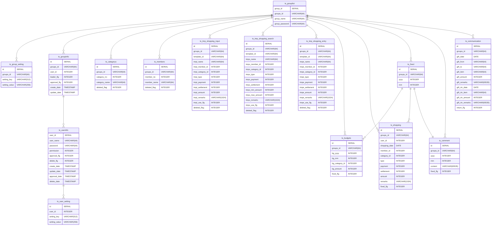

# ER図

```mermaid
erDiagram
    ts_grouplist {
        group_id SERIAL
        groups_id VARCHAR(64)
        group_name VARCHAR(64)
        group_password VARCHAR(64)
    }

    ts_userinfo {
        user_id SERIAL
        user_name VARCHAR(64)
        password VARCHAR(64)
        permission INTEGER
        approval_flg INTEGER
        delete_flg INTEGER
        create_date TIMESTAMP
        update_date TIMESTAMP
        approval_date TIMESTAMP
        delete_date TIMESTAMP
    }

    ts_groupinfo {
        id SERIAL
        groups_id VARCHAR(64)
        user_id INTEGER
        leader_flg INTEGER
        approval_flg INTEGER
        create_date TIMESTAMP
        update_date TIMESTAMP
    }

    ts_group_setting {
        id SERIAL
        groups_id VARCHAR(64)
        setting_key VARCHAR(512)
        setting_value VARCHAR(256)
    }

    ts_categorys {
        id SERIAL
        groups_id VARCHAR(64)
        category_no INTEGER
        category_name VARCHAR(64)
        deleted_flag INTEGER
    }

    ts_members {
        id SERIAL
        groups_id VARCHAR(64)
        member_no INTEGER
        member_name VARCHAR(64)
        deleted_flag INTEGER
    }

    ts_user_setting {
        id SERIAL
        user_id INTEGER
        setting_key VARCHAR(512)
        setting_value VARCHAR(256)
    }

    ts_tmp_shopping_input {
        id SERIAL
        groups_id VARCHAR(64)
        template_id VARCHAR(64)
        tmpi_name VARCHAR(64)
        tmpi_member_id INTEGER
        tmpi_category_id INTEGER
        tmpi_type INTEGER
        tmpi_payment INTEGER
        tmpi_settlement INTEGER
        tmpi_amount INTEGER
        tmpi_remarks VARCHAR(1024)
        tmpi_use_flg INTEGER
        deleted_flag INTEGER
    }

    ts_tmp_shopping_search {
        id SERIAL
        groups_id VARCHAR(64)
        template_id VARCHAR(64)
        tmps_name VARCHAR(64)
        tmps_member_id INTEGER
        tmps_category_id INTEGER
        tmps_type INTEGER
        tmps_payment INTEGER
        tmps_settlement INTEGER
        tmps_min_amount INTEGER
        tmps_max_amount INTEGER
        tmps_remarks VARCHAR(1024)
        tmps_use_flg INTEGER
        deleted_flag INTEGER
    }

    ts_tmp_shopping_entry {
        id SERIAL
        groups_id VARCHAR(64)
        template_id VARCHAR(64)
        tmpe_name VARCHAR(64)
        tmpe_member_id INTEGER
        tmpe_category_id INTEGER
        tmpe_type INTEGER
        tmpe_payment INTEGER
        tmpe_settlement INTEGER
        tmpe_amount INTEGER
        tmpe_remarks VARCHAR(1024)
        tmpe_use_flg INTEGER
        deleted_flag INTEGER
    }

    ts_budgets {
        id SERIAL
        groups_id VARCHAR(64)
        bg_yyyy INTEGER
        bg_mm INTEGER
        bg_category_id INTEGER
        bg_amount INTEGER
        fixed_flg INTEGER
    }

    ts_shopping {
        id SERIAL
        groups_id VARCHAR(64)
        user_id INTEGER
        shopping_date DATE
        member_id INTEGER
        category_id INTEGER
        type INTEGER
        payment INTEGER
        settlement INTEGER
        amount INTEGER
        remarks VARCHAR(1024)
        fixed_flg INTEGER
    }

    ts_fixed {
        id SERIAL
        groups_id VARCHAR(64)
        yyyy INTEGER
        mm INTEGER
    }

    ts_comment {
        id SERIAL
        groups_id VARCHAR(64)
        yyyy INTEGER
        mm INTEGER
        content VARCHAR(65535)
        fixed_flg INTEGER
    }

    ts_communication {
        id SERIAL
        groups_id VARCHAR(64)
        gift_date DATE
        gift_from VARCHAR(64)
        gift_to VARCHAR(64)
        gift_item VARCHAR(64)
        gift_amount INTEGER
        gift_remarks VARCHAR(65535)
        gift_rtn_date DATE
        gift_rtn_item VARCHAR(64)
        gift_rtn_amount INTEGER
        gift_rtn_remarks VARCHAR(65535)
        return_flg INTEGER
    }

    %% グループ一覧
    ts_grouplist ||--o{ ts_group_setting: ""
    ts_grouplist ||--o{ ts_groupinfo: ""
    ts_grouplist ||--o{ ts_categorys: ""
    ts_grouplist ||--o{ ts_members: ""
    ts_grouplist ||--o{ ts_tmp_shopping_input: ""
    ts_grouplist ||--o{ ts_tmp_shopping_search: ""
    ts_grouplist ||--o{ ts_tmp_shopping_entry: ""
    ts_grouplist ||--o{ ts_budgets: ""
    ts_grouplist ||--o{ ts_shopping: ""
    ts_grouplist ||--o{ ts_fixed: ""
    ts_grouplist ||--o{ ts_comment: ""
    ts_grouplist ||--o{ ts_communication: ""

    %%ユーザー情報
    ts_groupinfo ||--o{ ts_userinfo: ""
    ts_userinfo ||--o{ ts_user_setting:""

    ts_fixed ||--o{ ts_budgets: ""
    ts_fixed ||--o{ ts_shopping: ""
    ts_fixed ||--|| ts_comment: ""

```

