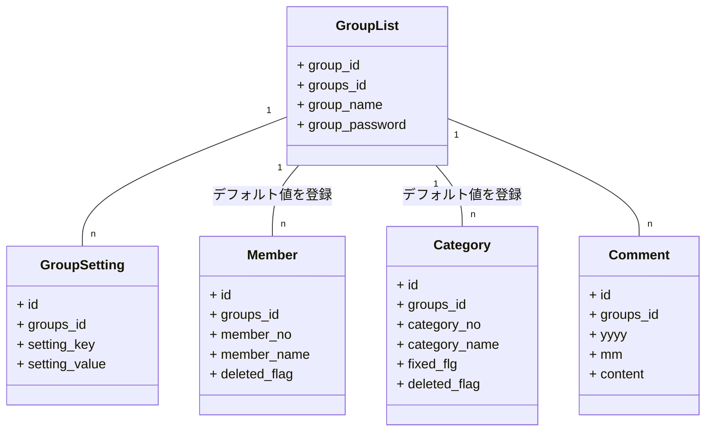

## グループ一覧

```mermaid
classDiagram
    class GroupList {
        + group_id
        + groups_id
        + group_name
        + group_password
    }

    class GroupSetting {
        + id
        + groups_id
        + setting_key
        + setting_value
    }

    class Member {
        + id
        + groups_id
        + member_no
        + member_name
        + deleted_flag
    }

    class Category {
        + id
        + groups_id
        + category_no
        + category_name
        + fixed_flg
        + deleted_flag
    }

    class Comment {
        + id
        + groups_id
        + yyyy
        + mm
        + content
    }

    GroupList "1" -- "n" GroupSetting
    GroupList "1" -- "n" Member: デフォルト値を登録
    GroupList "1" -- "n" Category: デフォルト値を登録
    GroupList "1" -- "n" Comment

```
