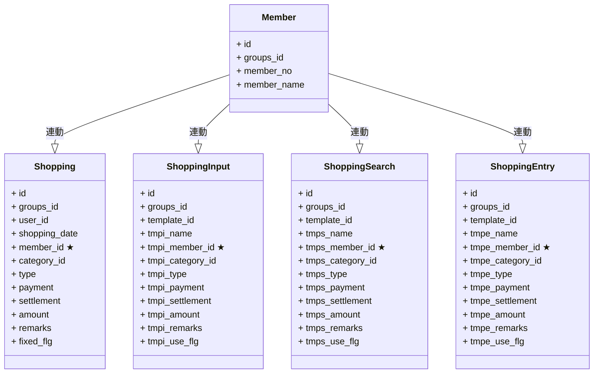

## メンバー

```mermaid
classDiagram
    class Member {
        + id
        + groups_id
        + member_no
        + member_name
    }

    class Shopping {
        + id
        + groups_id
        + user_id
        + shopping_date
        + member_id ★
        + category_id
        + type
        + payment
        + settlement
        + amount
        + remarks
        + fixed_flg
    }

    class ShoppingInput {
        + id
        + groups_id
        + template_id
        + tmpi_name
        + tmpi_member_id ★
        + tmpi_category_id
        + tmpi_type
        + tmpi_payment
        + tmpi_settlement
        + tmpi_amount
        + tmpi_remarks
        + tmpi_use_flg
    }

    class ShoppingSearch {
        + id
        + groups_id
        + template_id
        + tmps_name
        + tmps_member_id ★
        + tmps_category_id
        + tmps_type
        + tmps_payment
        + tmps_settlement
        + tmps_amount
        + tmps_remarks
        + tmps_use_flg
    }

    class ShoppingEntry {
        + id
        + groups_id
        + template_id
        + tmpe_name
        + tmpe_member_id ★
        + tmpe_category_id
        + tmpe_type
        + tmpe_payment
        + tmpe_settlement
        + tmpe_amount
        + tmpe_remarks
        + tmpe_use_flg
    }

    Member --|> Shopping: 連動
    Member --|> ShoppingInput: 連動
    Member --|> ShoppingSearch: 連動
    Member --|> ShoppingEntry: 連動
```
