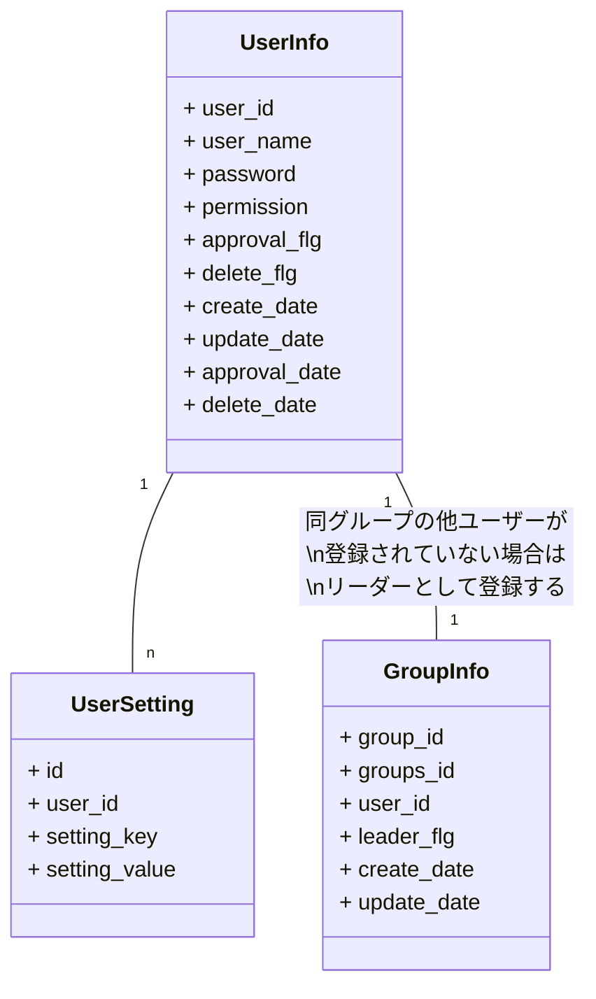

## ユーザー情報

```mermaid
classDiagram
    class UserInfo {
        + user_id
        + user_name
        + password
        + permission
        + approval_flg
        + delete_flg
        + create_date
        + update_date
        + approval_date
        + delete_date
    }

    class UserSetting {
        + id
        + user_id
        + setting_key
        + setting_value
    }

    class GroupInfo {
        + group_id
        + groups_id
        + user_id
        + leader_flg
        + create_date
        + update_date
    }

    UserInfo "1" -- "n" UserSetting
    UserInfo "1" -- "1" GroupInfo: 同グループの他ユーザーが\n登録されていない場合は\nリーダーとして登録する

```
