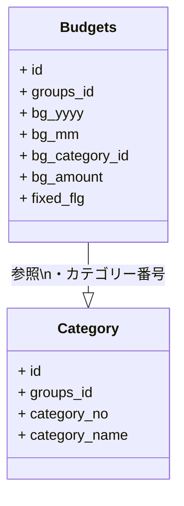

## 予算

```mermaid
classDiagram
    class Budgets {
        + id
        + groups_id
        + bg_yyyy
        + bg_mm
        + bg_category_id
        + bg_amount
        + fixed_flg
    }

    class Category {
        + id
        + groups_id
        + category_no
        + category_name
    }

    Budgets --|> Category: 参照\n・カテゴリー番号

```
