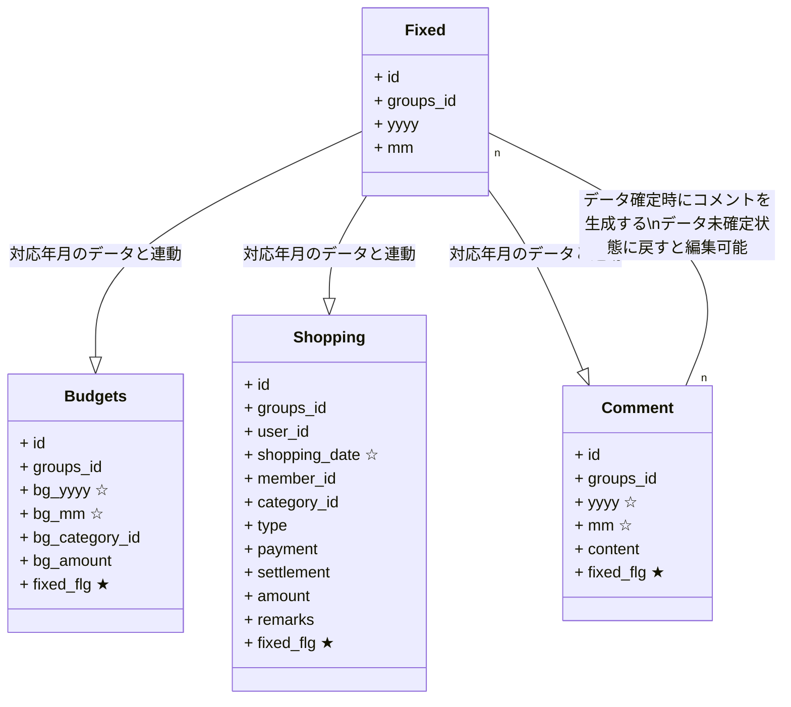

## 確定データ

```mermaid
classDiagram
    class Fixed {
        + id
        + groups_id
        + yyyy
        + mm
    }

    class Budgets {
        + id
        + groups_id
        + bg_yyyy ☆
        + bg_mm ☆
        + bg_category_id
        + bg_amount
        + fixed_flg ★
    }
    
    class Shopping {
        + id
        + groups_id
        + user_id
        + shopping_date ☆
        + member_id
        + category_id
        + type
        + payment
        + settlement
        + amount
        + remarks
        + fixed_flg ★
    }

    class Comment {
        + id
        + groups_id
        + yyyy ☆
        + mm ☆
        + content
        + fixed_flg ★
    }

    Fixed --|> Budgets:対応年月のデータと連動
    Fixed --|> Shopping:対応年月のデータと連動
    Fixed --|> Comment:対応年月のデータと連動
    
    Fixed "n" -- "n" Comment:データ確定時にコメントを生成する\nデータ未確定状態に戻すと編集可能

```
