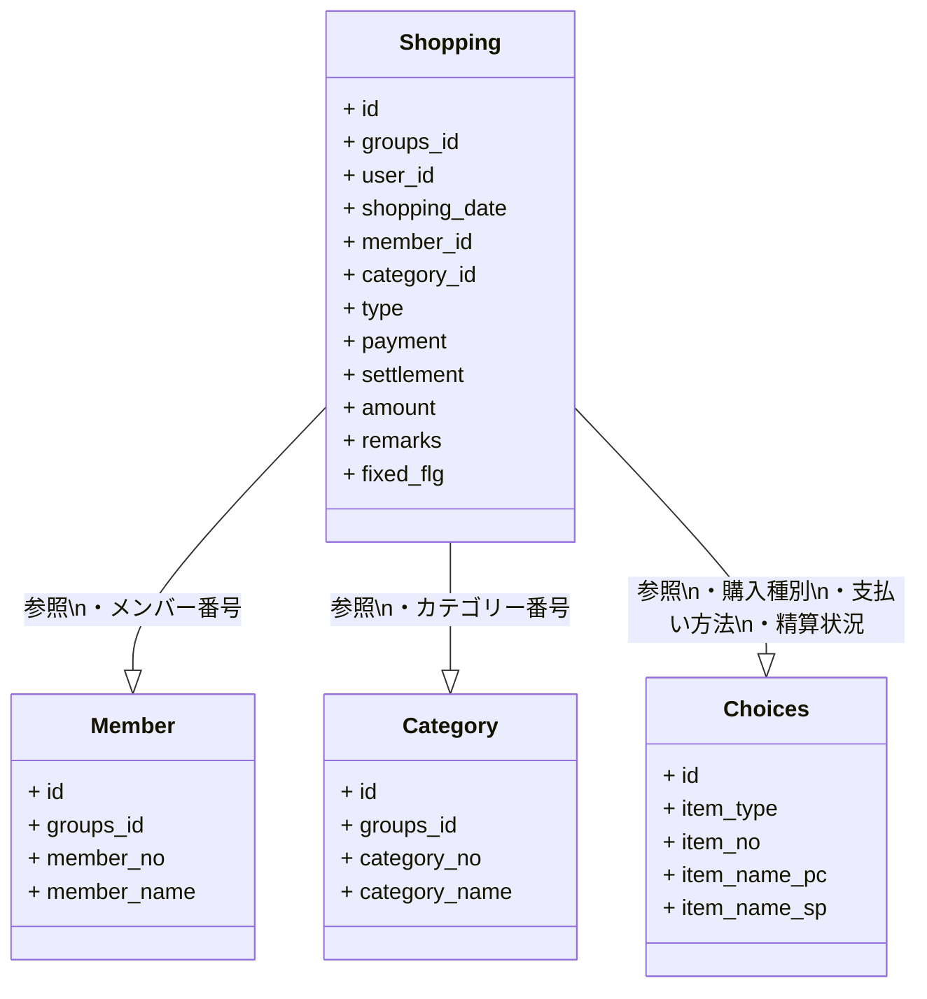

## 購入データ入力テンプレート

```mermaid
classDiagram
    class Shopping {
        + id
        + groups_id
        + user_id
        + shopping_date
        + member_id
        + category_id
        + type
        + payment
        + settlement
        + amount
        + remarks
        + fixed_flg
    }

    class Member {
        + id
        + groups_id
        + member_no
        + member_name
    }

    class Category {
        + id
        + groups_id
        + category_no
        + category_name
    }

    class Choices {
        + id
        + item_type
        + item_no
        + item_name_pc
        + item_name_sp
    }

    Shopping --|> Member:参照\n・メンバー番号
    Shopping --|> Category:参照\n・カテゴリー番号
    Shopping --|> Choices:参照\n・購入種別\n・支払い方法\n・精算状況

```
