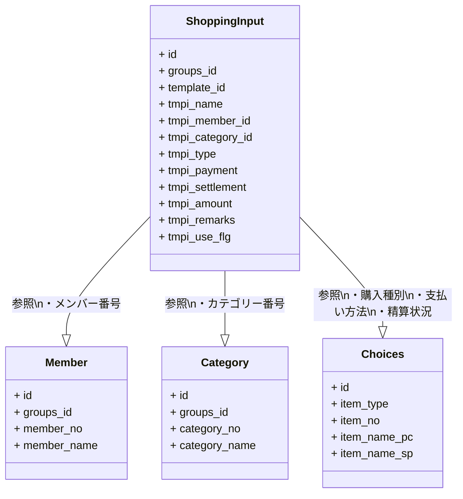

## 購入データ入力テンプレート

```mermaid
classDiagram
    class ShoppingInput {
        + id
        + groups_id
        + template_id
        + tmpi_name
        + tmpi_member_id
        + tmpi_category_id
        + tmpi_type
        + tmpi_payment
        + tmpi_settlement
        + tmpi_amount
        + tmpi_remarks
        + tmpi_use_flg
    }

    class Member {
        + id
        + groups_id
        + member_no
        + member_name
    }

    class Category {
        + id
        + groups_id
        + category_no
        + category_name
    }

    class Choices {
        + id
        + item_type
        + item_no
        + item_name_pc
        + item_name_sp
    }

    ShoppingInput --|> Member: 参照\n・メンバー番号
    ShoppingInput --|> Category: 参照\n・カテゴリー番号
    ShoppingInput --|> Choices: 参照\n・購入種別\n・支払い方法\n・精算状況

```
