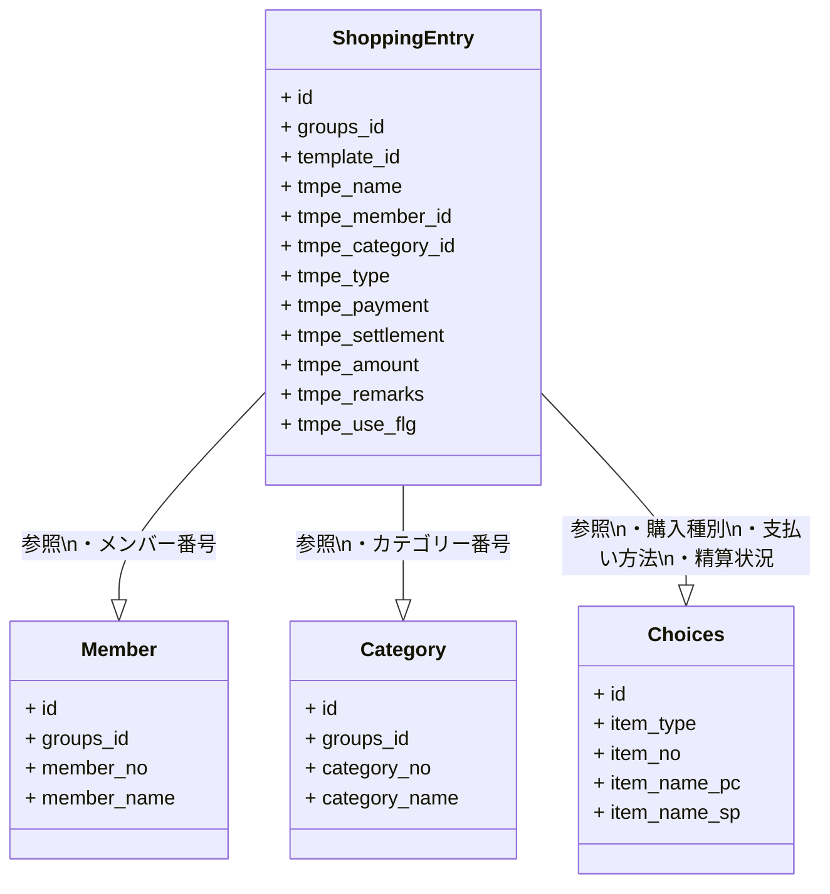

## 購入データ登録テンプレート

```mermaid
classDiagram
    class ShoppingEntry {
        + id
        + groups_id
        + template_id
        + tmpe_name
        + tmpe_member_id
        + tmpe_category_id
        + tmpe_type
        + tmpe_payment
        + tmpe_settlement
        + tmpe_amount
        + tmpe_remarks
        + tmpe_use_flg
    }

    class Member {
        + id
        + groups_id
        + member_no
        + member_name
    }

    class Category {
        + id
        + groups_id
        + category_no
        + category_name
    }

    class Choices {
        + id
        + item_type
        + item_no
        + item_name_pc
        + item_name_sp
    }

    ShoppingEntry --|> Member: 参照\n・メンバー番号
    ShoppingEntry --|> Category: 参照\n・カテゴリー番号
    ShoppingEntry --|> Choices: 参照\n・購入種別\n・支払い方法\n・精算状況

```
