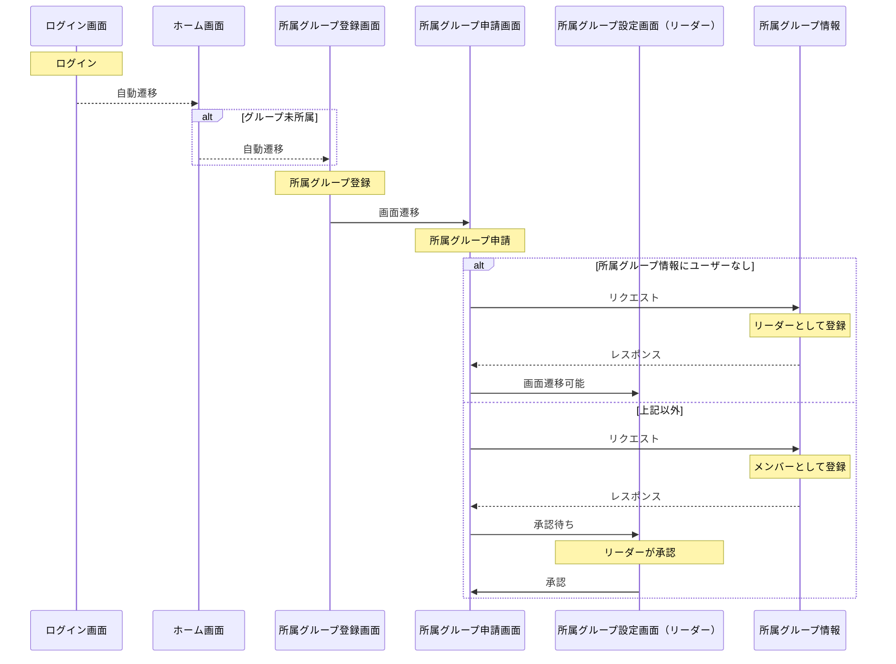
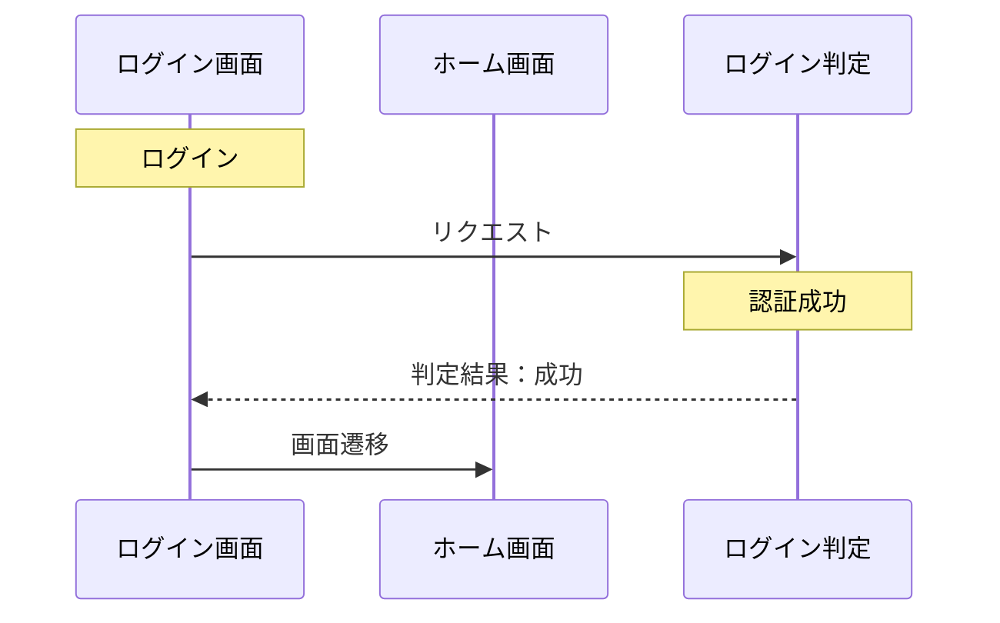

# 所属グループ登録・配属

## 概要

所属グループ登録から配属までのユースケースを定義する

## フロー図

### 所属グループ登録 > 配属 基本フロー

```mermaid
sequenceDiagram
    participant ログイン画面
    participant ホーム画面
    participant 所属グループ登録画面
    participant 所属グループ申請画面
    participant 所属グループ設定画面（リーダー）
    participant 所属グループ情報

    Note over ログイン画面: ログイン
    ログイン画面 -->> ホーム画面:自動遷移
    
    alt グループ未所属
        ホーム画面 -->> 所属グループ登録画面:自動遷移
    end
    Note over 所属グループ登録画面: 所属グループ登録

    所属グループ登録画面 ->> 所属グループ申請画面:画面遷移
    Note over 所属グループ申請画面: 所属グループ申請
    alt 所属グループ情報にユーザーなし
        所属グループ申請画面 ->> 所属グループ情報:リクエスト
        Note over 所属グループ情報: リーダーとして登録
        所属グループ情報 -->> 所属グループ申請画面:レスポンス
        所属グループ申請画面 ->> 所属グループ設定画面（リーダー）:画面遷移可能
    else 上記以外
        所属グループ申請画面 ->> 所属グループ情報:リクエスト
        Note over 所属グループ情報: メンバーとして登録
        所属グループ情報 -->> 所属グループ申請画面:レスポンス
        所属グループ申請画面 ->> 所属グループ設定画面（リーダー）:承認待ち
        Note over 所属グループ設定画面（リーダー）: リーダーが承認
        所属グループ設定画面（リーダー） ->> 所属グループ申請画面:承認
    end

```

### 配属：メンバー

```mermaid
sequenceDiagram
    participant ログイン画面
    participant ホーム画面
    participant ログイン判定
    
    Note over ログイン画面: ログイン

    ログイン画面 ->> ログイン判定: リクエスト
    Note over ログイン判定: 認証成功
    ログイン判定 -->> ログイン画面: 判定結果：成功
    ログイン画面 ->> ホーム画面: 画面遷移
```
