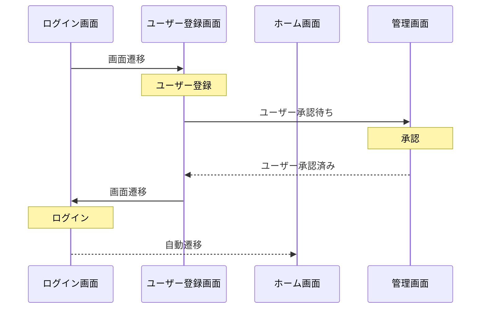
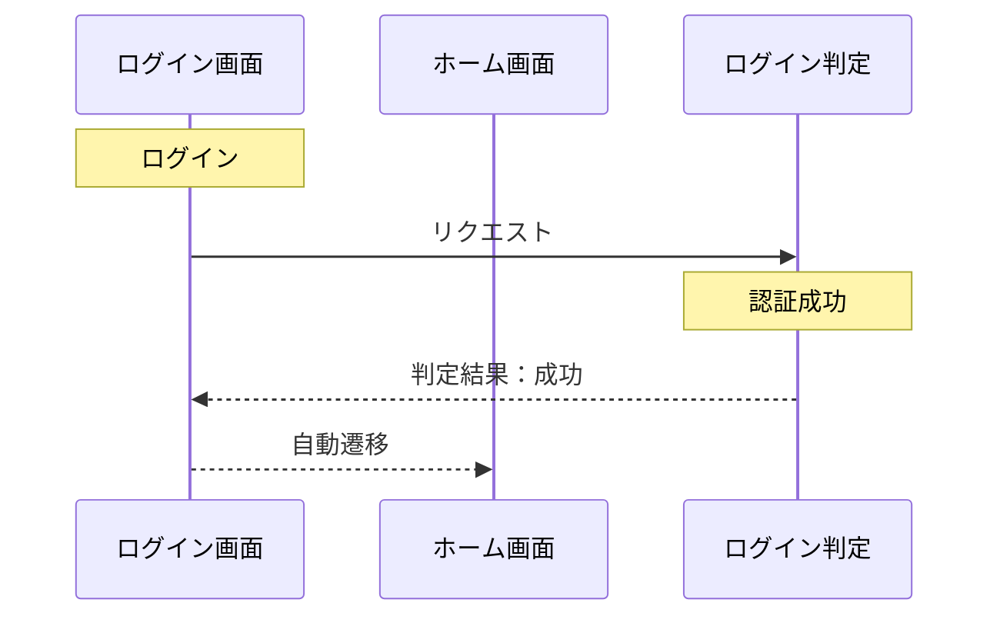
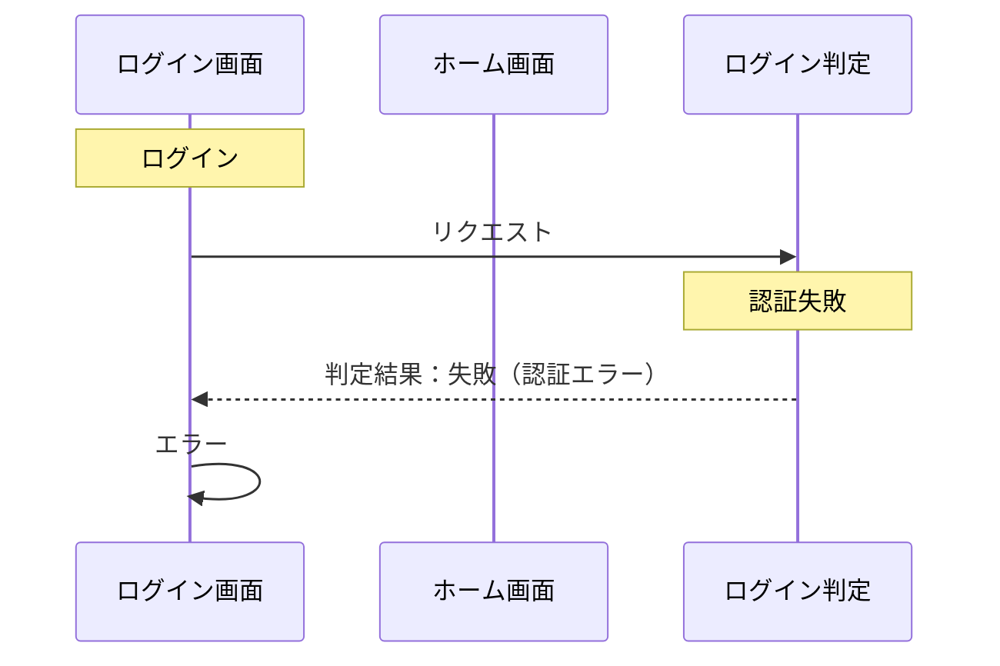
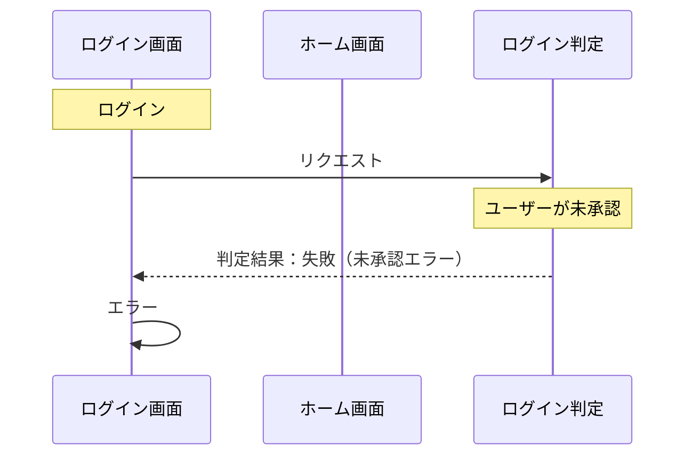
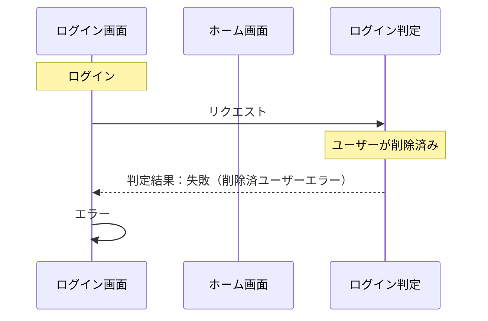

# ユーザー登録・ログイン

## 概要

ユーザー登録からログインまでのユースケースを定義する

## フロー図

### ユーザー登録 > ログイン 基本フロー

```mermaid
sequenceDiagram
    participant ログイン画面
    participant ユーザー登録画面
    participant ホーム画面
    participant 管理画面
    
    ログイン画面 ->> ユーザー登録画面:画面遷移
    Note over ユーザー登録画面: ユーザー登録
    ユーザー登録画面 ->> 管理画面:ユーザー承認待ち
    Note over 管理画面: 承認
    管理画面 -->> ユーザー登録画面:ユーザー承認済み
    ユーザー登録画面 ->> ログイン画面:画面遷移
    Note over ログイン画面: ログイン
    ログイン画面 -->> ホーム画面:自動遷移

```

### ログイン判定：成功

```mermaid
sequenceDiagram
    participant ログイン画面
    participant ホーム画面
    participant ログイン判定
    
    Note over ログイン画面: ログイン

    ログイン画面 ->> ログイン判定: リクエスト
    Note over ログイン判定: 認証成功
    ログイン判定 -->> ログイン画面: 判定結果：成功
    ログイン画面 -->> ホーム画面: 自動遷移
```

### ログイン判定：失敗（認証エラー）

```mermaid
sequenceDiagram
    participant ログイン画面
    participant ホーム画面
    participant ログイン判定
    
    Note over ログイン画面: ログイン

    ログイン画面 ->> ログイン判定: リクエスト
    Note over ログイン判定: 認証失敗
    ログイン判定 -->> ログイン画面: 判定結果：失敗（認証エラー）
    ログイン画面 ->> ログイン画面: エラー
```

### ログイン判定：失敗（未承認エラー）

```mermaid
sequenceDiagram
    participant ログイン画面
    participant ホーム画面
    participant ログイン判定
    
    Note over ログイン画面: ログイン

    ログイン画面 ->> ログイン判定: リクエスト
    Note over ログイン判定: ユーザーが未承認
    ログイン判定 -->> ログイン画面: 判定結果：失敗（未承認エラー）
    ログイン画面 ->> ログイン画面: エラー
```

### ログイン判定：失敗（削除済ユーザーエラー）

```mermaid
sequenceDiagram
    participant ログイン画面
    participant ホーム画面
    participant ログイン判定
    
    Note over ログイン画面: ログイン

    ログイン画面 ->> ログイン判定: リクエスト
    Note over ログイン判定: ユーザーが削除済み
    ログイン判定 -->> ログイン画面: 判定結果：失敗（削除済ユーザーエラー）
    ログイン画面 ->> ログイン画面: エラー
```